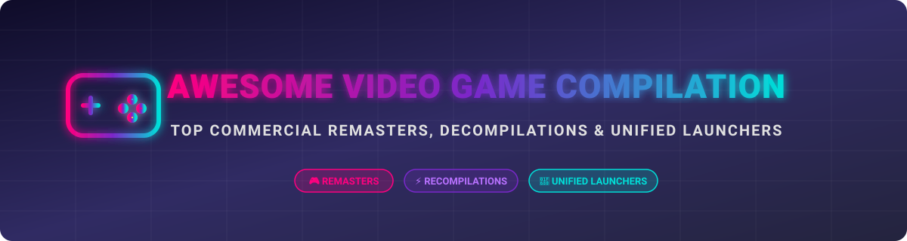

# 🎮 Awesome Video Game Compilation Ecosystem 🚀

  
  
  
  
  

> 🌟 **A curated directory of top commercial game compilations, open-source recompilations, retro decompilations, and unified frontends/launchers.**

---

## 📌 Overview & SEO Keywords

Welcome to the definitive awesome list for **video game compilations**, **community recompilation ports**, **game decompilation projects**, and **unified game library frontends**. Whether you are looking for classic commercial remasters (such as *Halo: The Master Chief Collection* or *Mass Effect Legendary Edition*) or open-source solutions to organize your retro gaming library (*Playnite*, *RetroArch*, *OpenEmu*), this repository curates the best tools and releases available.

---

## 📑 Table of Contents

- [🏢 SaaS & Commercial Hosted Platforms](#-saas--commercial-hosted-platforms)
- [⚡ Open-Source GitHub Projects](#-open-source-github-projects)
- [🤝 How to Contribute](#-how-to-contribute)
- [⚠️ Disclaimer](#️-disclaimer)

---

## 🏢 SaaS & Commercial Hosted Platforms

> 💡 **Market Size & Structure Analysis**:  
> The commercial video game compilations, remasters, and cloud/digital distribution market is estimated at **$18.5 Billion+ USD** globally. This sector is **highly concentrated** (winner-take-all / oligopoly dynamic), dominated by major AAA studio publishers (Microsoft, Sony, Nintendo, EA, Activision Blizzard, Capcom, 2K Games, Sega) leveraging exclusive first-party IP and high-budget remasters to capture the vast majority of player engagement and revenue.

Below is a structured overview of top commercial game compilation releases, sorted in **descending order by company size** (market capitalization / publisher valuation):

| Publisher / Parent Company | Platform / Compilation Title | Market Cap / Valuation | Pricing (Starting Tier) | Free Tier Limit / Free Trial | Features & Overview |
| :--- | :--- | :--- | :--- | :--- | :--- |
| 🏰 **Microsoft** | **[Halo: The Master Chief Collection](https://www.xbox.com/games/halo-the-master-chief-collection)** | **$3,150.00 Billion** | $39.99 (Base Purchase) | Included in Xbox Game Pass ($9.99/mo, 14-day trial for $1) | Bundles *Halo 1-4*, *ODST*, and *Reach* into one unified launcher with cross-game matchmaking, Forge mode, and custom browsers. |
| 🎮 **Sony Group** | **[Uncharted: The Nathan Drake Collection](https://www.playstation.com/games/uncharted-the-nathan-drake-collection/)** | **$125.00 Billion** | $19.99 (Base Purchase) | Included in PlayStation Plus Extra ($14.99/mo, 7-day free trial) | Remastered trilogy of *Uncharted 1-3* for PS4/PS5 with 1080p/60fps enhancements, photo mode, and trophy support. |
| 🍄 **Nintendo** | **[Super Mario 3D All-Stars](https://www.nintendo.com/store/products/super-mario-3d-all-stars-switch/)** | **$68.00 Billion** | $59.99 (Physical / Retail MSRP) | No free tier or trial (limited retail software release) | Bundles *Super Mario 64*, *Super Mario Sunshine*, and *Super Mario Galaxy* for Switch with updated resolutions and controls. |
| 💥 **Activision Blizzard** (Microsoft) | **[Crash Bandicoot N. Sane Trilogy](https://www.crashbandicoot.com/)** | **$68.00 Billion** | $39.99 (Base Purchase) | Included in Xbox Game Pass ($9.99/mo, 14-day trial for $1) | Ground-up remake of *Crash Bandicoot 1-3* with modern HD visuals, unified save system, and time trial modes. |
| 🐉 **Activision Blizzard** (Microsoft) | **[Spyro Reignited Trilogy](https://www.spyrothedragon.com/)** | **$68.00 Billion** | $39.99 (Base Purchase) | Included in Xbox Game Pass ($9.99/mo, 14-day trial for $1) | Complete HD visual and audio remake of *Spyro 1-3* with modernized controls and dynamic lighting. |
| 🚀 **Electronic Arts (EA)** | **[Mass Effect Legendary Edition](https://www.ea.com/games/mass-effect/mass-effect-legendary-edition)** | **$38.50 Billion** | $59.99 (Base Purchase) | Included in EA Play ($5.99/mo) / Game Pass Ultimate | Comprehensive remaster of *Mass Effect 1-3* with all single-player DLC, unified character creator, and visual overhauls. |
| 🦔 **Sega Sammy Holdings** | **[Sonic Origins](https://sonic.fandom.com/wiki/Sonic_Origins)** | **$4.20 Billion** | $29.99 (Base Purchase) | 2-hour free trial on PlayStation Plus Premium | Bundles *Sonic 1*, *Sonic 2*, *Sonic 3 & Knuckles*, and *Sonic CD* with widescreen support and new cutscenes. |
| 🕹️ **Capcom** | **[Mega Man Legacy Collection](https://www capcom.com/megaman/)** | **$3.80 Billion** | $14.99 (Base Purchase) | Capcom Arcade Stadium free tier includes *Street Fighter II* trial | Compiles original *Mega Man 1-6* with added Museum Mode, challenge remixes, dynamic rewind, and boss rush modes. |
| 🗽 **Take-Two Interactive** (2K) | **[BioShock: The Collection](https://www.2k.com/bioshock/)** | **$2.90 Billion** | $49.99 (Base Purchase) | 2-hour free trial on PlayStation Plus Premium | Remastered bundle of *BioShock 1*, *BioShock 2*, and *BioShock Infinite* including director's commentary and DLCs. |

---

## ⚡ Open-Source GitHub Projects

> 🔓 **Open-Source Ecosystem**:  
> The open-source community provides powerful tools for library management, frontend interfaces, N64/PC recompilations, and game decompilations.

The projects below are sorted in **descending order by GitHub Stars_Count**. Beside each project name is a live Stars_Badge linking directly to the repository's stargazers page:

1. 🕹️ **[OpenEmu](https://github.com/OpenEmu/OpenEmu)**   
   *All-in-one retro video game emulation environment designed specifically for macOS with a clean iTunes-style UI.*

2. 🎮 **[RetroArch](https://github.com/libretro/RetroArch)**   
   *Cross-platform frontend for emulators, game engines, and media players using the Libretro API framework.*

3. 🚀 **[Playnite](https://github.com/JosefNemec/Playnite)**   
   *The premier open-source video game library manager and launcher. Unifies Steam, GOG, Epic, and ROM emulation libraries into a customizable interface.*

4. 🥧 **[RetroPie](https://github.com/RetroPie/RetroPie-Setup)**   
   *Turns Raspberry Pi, PC, or ODroid into a retro-gaming console aggregating EmulationStation, RetroArch, and standalone emulators.*

5. ⚡ **[N64Recomp](https://github.com/N64Recomp/N64Recomp)**   
   *Tool set for static recompilation of Nintendo 64 ROMs into native executable C/C++ PC ports with modern hardware acceleration.*

6. 🗡️ **[Ship of Harkinian](https://github.com/HarbourMasters/Shipwright)**   
   *Native PC port of The Legend of Zelda: Ocarina of Time derived from N64 decompilation, featuring 4K/60fps, modding, widescreen, and randomizers.*

7. 💨 **[Unleashed Recomp](https://github.com/hedge-dev/UnleashedRecomp)**   
   *Native PC recompilation of Sonic Unleashed (Xbox 360/PS3) providing ultra-high framerates, reduced load times, and custom mod support.*

8. 🐧 **[Batocera.linux](https://github.com/batocera-linux/batocera.linux)**   
   *Open-source retro-gaming bootable Linux distribution turning any PC or single-board computer into a dedicated gaming console.*

9. 📱 **[iiSU](https://github.com/iisu-network/iiSU)**   
   *Dual-screen capable Android emulation frontend designed for handhelds, featuring custom widgets and dynamic game collection views.*

10. 🏎️ **[SpaghettiKart](https://github.com/HarbourMasters/SpaghettiKart)**   
    *Native PC port of Mario Kart 64 built via decompilation, bringing modern resolution rendering, ultra-wide support, and controller mapping.*

11. 🕵️ **[Perfect Dark PC Port](https://github.com/fgsfdsfgs/perfect_dark)**   
    *Native PC decompilation port of Perfect Dark featuring mouse-look aim, high framerates, and modern display configurations.*

12. 🎠 **[Pegasus Frontend](https://github.com/mmatyas/pegasus-frontend)**   
    *Cross-platform graphical frontend for launching games and emulators with extreme theme flexibility across desktop and mobile devices.*

13. 🤠 **[TRX – Tomb Raider I-III: Community Edition](https://github.com/LostArtefacts/TRX)**   
    *The gold standard open-source compilation engine unifying Tomb Raider I, II, and III into a single enhanced engine with modern QoL features.*

14. 🗃️ **[Omakade](https://github.com/btsouth/omakade)**   
    *Unified launcher for organizing local PC games, RetroArch playlists, and digital store libraries with dynamic filtering and sofa mode.*

15. 🔮 **[RetroHub](https://github.com/retrohub-org/retrohub)**   
    *Godot engine-powered retro gaming frontend delivering responsive 2D/3D user interfaces with zero zero-config emulator detection.*

16. 🕹️ **[EmuHub](https://github.com/Tw1tchy0/EmuHub)**   
    *Lightweight Windows launcher unifying ROM libraries across 16 retro console platforms with automatic SteamGridDB artwork fetching.*

17. 📦 **[JàmmBox](https://github.com/KerHack-Libre/JammBox)**   
    *DOS game compilation framework featuring a lightweight C-based terminal/GUI launcher integrated with DOSBox.*

18. 📜 **[Crispy Trilogy](https://github.com/nicoku007/CRISPY-TRILOGY-for-Heretic-hexen-Strife)**   
    *Trilogy collection launcher consolidating Crispy Heretic, Crispy Hexen, and Crispy Strife into one configuration utility.*

---

## 🤝 How to Contribute

1. 🍴 **Fork** this repository.
2. 📝 **Add or edit** entries in `README.md` keeping formatting consistent.
3. 📌 **Include**: Project Name, Official/GitHub URL, Stars_Badge, concise description, and tags.
4. 🚀 **Submit a Pull Request** with a brief summary of additions.

---

## ⚠️ Disclaimer

- ℹ️ This is a **community-curated index** created for educational and preservation purposes.
- 📜 **Legal Notice**: Native recompilations and decompilation projects **do not contain copyrighted game assets, ROMs, or BIOS files**. Users must supply legally owned original game files.
- 🛡️ **Emulation Legality**: Always ensure compliance with local copyright laws regarding digital software backups and rom management.

---

## 💖 Support & Sponsor

Thank you for visiting and using this repository! If you find this curated list of video game compilations and open-source projects helpful:

- ⭐ **Star** this repository to show your support.
- 🍴 **Fork** and contribute new tools or updates.
- 📢 **Share** it with fellow retro gaming enthusiasts and developers.
- ☕ **Buy me a coffee / Sponsor**: If you'd like to support ongoing open-source maintenance and project development, consider sponsoring via the [GitHub Sponsor Dashboard](https://github.com/sponsors/ishandutta2007).

---

## 📜 Star History

---

<b>Made with ❤️ for retro gaming enthusiasts, game preservation advocates, and software compilation developers.</b>

